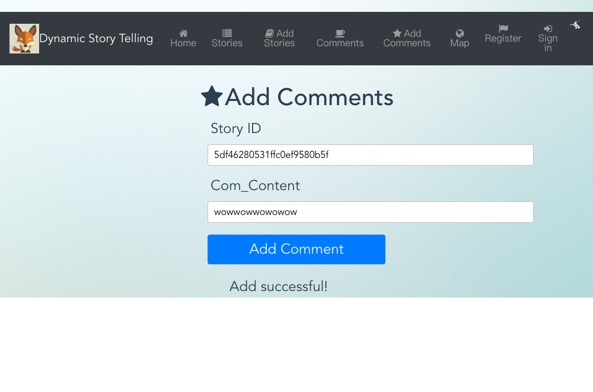
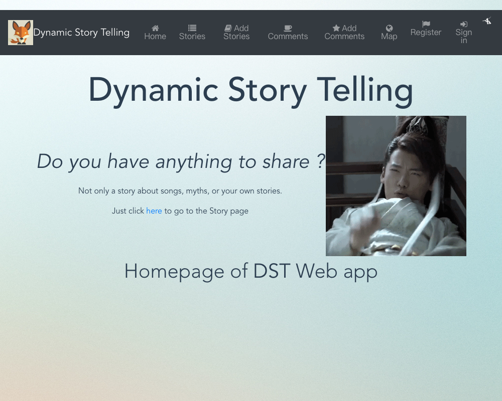
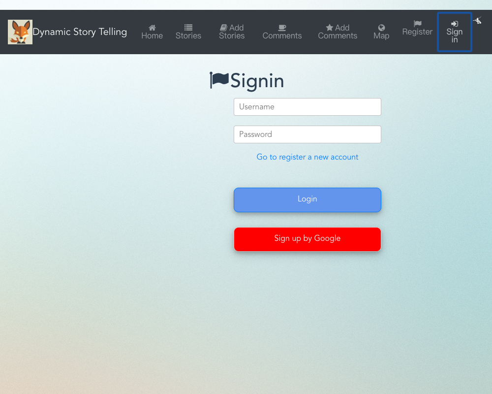
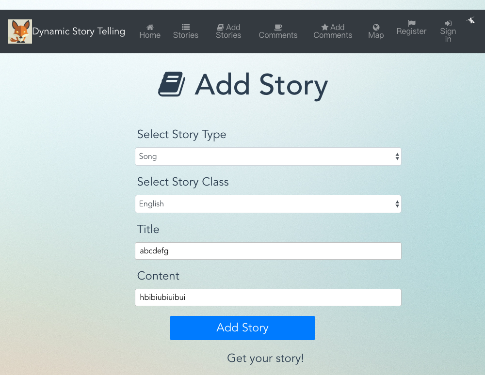
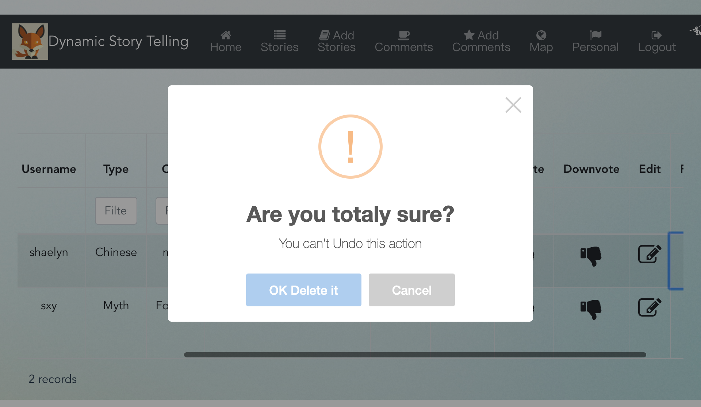
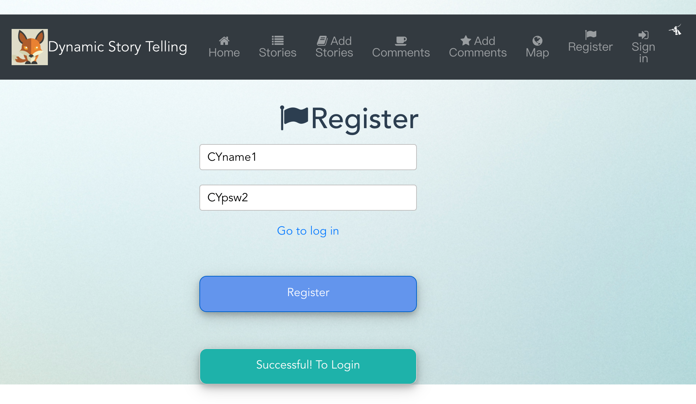
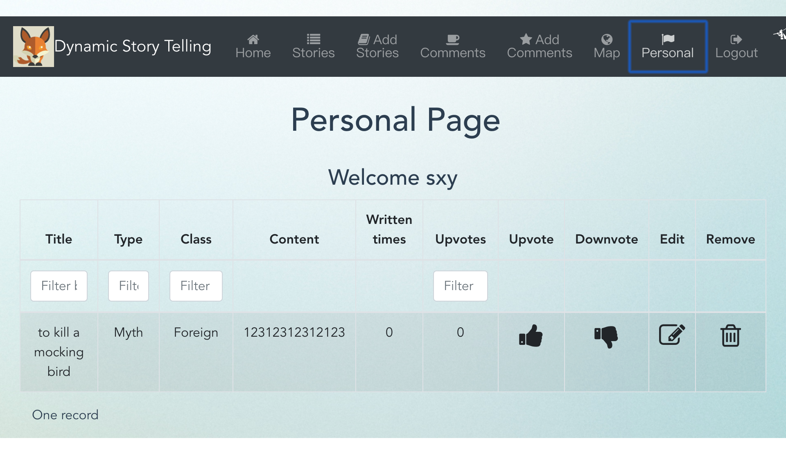
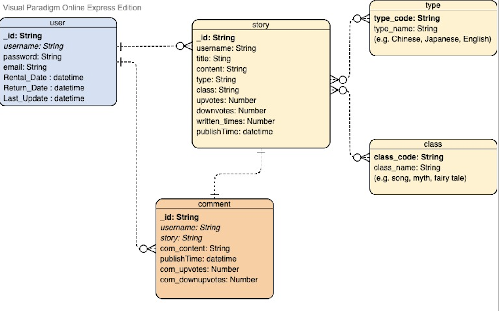
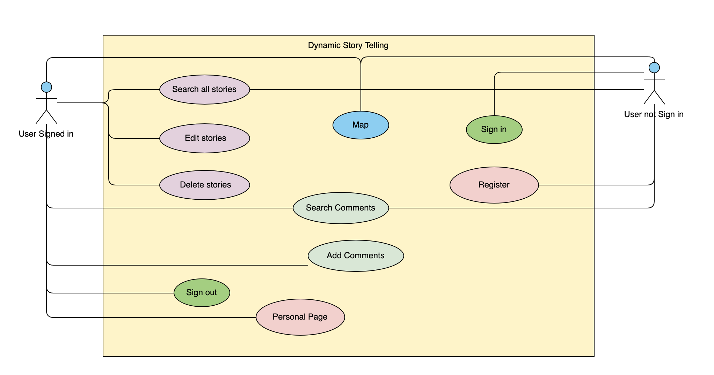

# Assignment 2 - Agile Software Practice.

Name: Xinyue Sun (Shaelyn)

## Client UI.

>Allows the user add a new comments

>Allows the user search comments by a story ID

> Test Home page content

>Test top Bar content and url

>Add a new story

>The rest of the user tests pass the test when using Cypress alone, but the tests always fail when running the Cypress.io dashboard.
>So these pictures are tested by Cypress alone and stored by cy.screenshot()

>This one tests the editing and deleting functions of the story display page. Test the jump page to edit the story, delete a story, get two warning boxes, select "Delete" for the first time, and "Cancel" for the second time.

>Register a new user

>Login a user and return personal page

## Web API CI.
https://shaelynsun.gitlab.io/cicd-dst

## GitLab CI.
https://gitlab.com/ShaelynSun/dstvue-cicd

## Client Deploy
http://dstvue-prod.surge.sh/

## Data Model

## UML Diagrams

