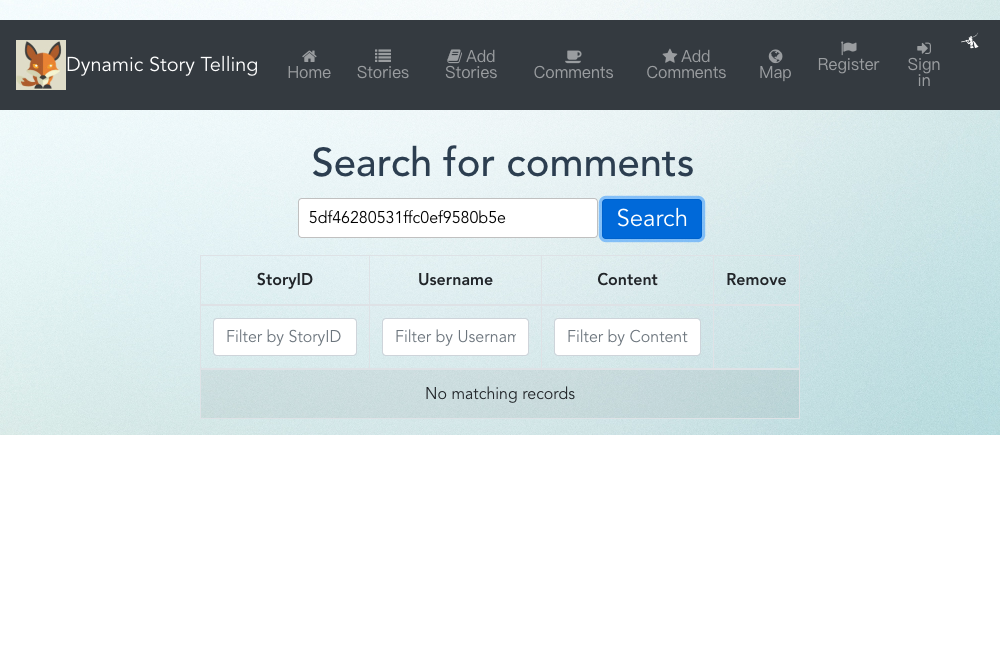

# Assignment 2 - Agile Software Practice.

Name: Xinyue Sun (Shaelyn)

## Client UI.

>Allows the user add a new comments

>Allows the user search comments by a story ID

> Test Home page content

>Test top Bar content and url

![addStory][src/public/images/dstVueTest-Stories-Add -- Add Stories page.png]
>Add a new story

>The rest of the user tests pass the test when using Cypress alone, but the tests always fail when running the Cypress.io dashboard.
## Web API CI.
https://shaelynsun.gitlab.io/cicd-dst

## GitLab CI.
https://gitlab.com/ShaelynSun/dstvue-cicd

